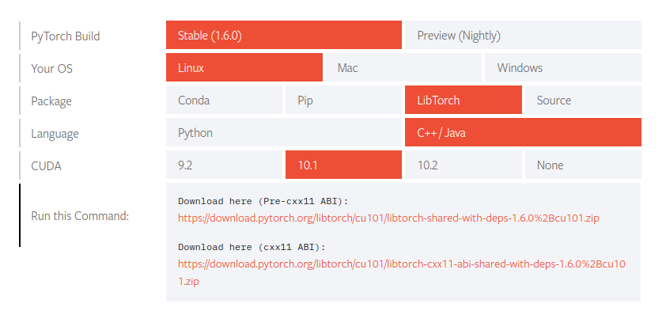

### Getting the torch example to comple

do all the steps from the main readme  (install blasfeo, pybullet, etc)

check installed version of cuda toolkit, eg: 10.1
```
ls /usr/local/cuda-10.1
bin     include    libnvvp  nsightee_plugins  README   src      version.txt
doc     lib64      LICENSE  nvml              samples  targets
extras  libnsight  local    nvvm              share    tools
``` 

download libtorch for your cuda-toolkit version, 
*download cxx11-abi version, only that one 
will work as it's compiled with C11 ABI*

https://pytorch.org/get-started/locally/



extract libtorch to /opt (use sudo)

if cudatoolkit 10.1, you will need to install libcublas.so and softlink it
(I just linked to the one installed in cudatoolkit 10.0 and it worked ok)

```
cd /usr/local/cuda-10.1/lib64
sudo ln -sf /usr/local/cuda-10.0/lib64/libcublas.so.10.0.130 libcublas.so
```

then in tiny-differentiable-simulator

```
mkdir build
cd build
CMAKE_PREFIX_PATH=/opt/blasfeo:/opt/libtorch cmake -DCMAKE_EXPORT_COMPILE_COMMANDS=ON -DCUDA_TOOLKIT_ROOT_DIR=/usr/local/cuda-10.1 .. 
make VERBOSE=1 torch_example
```